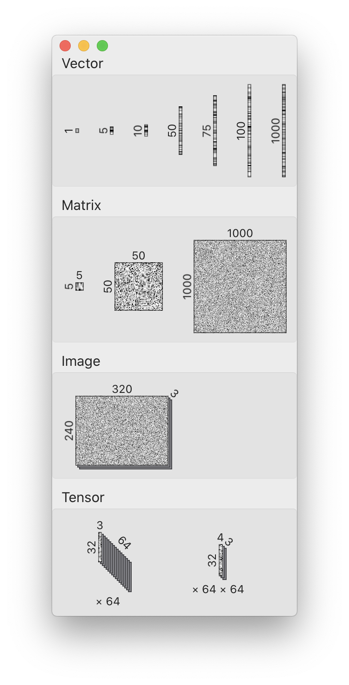
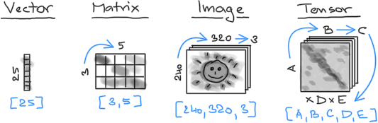
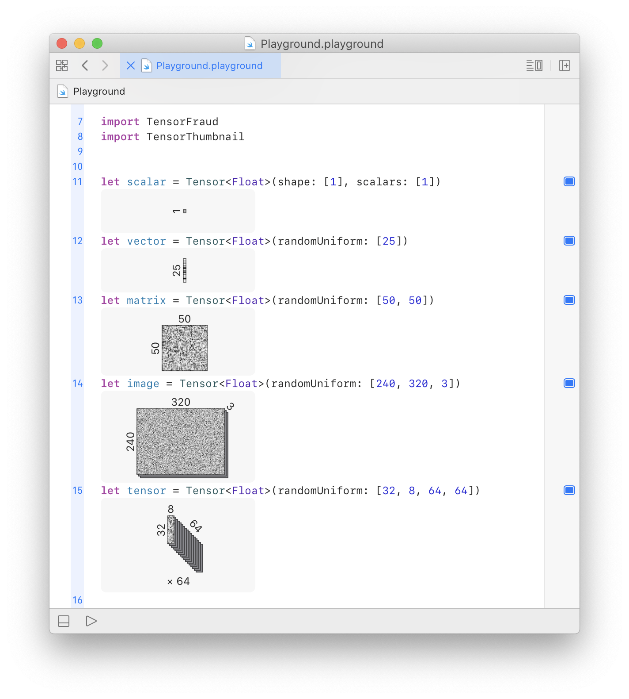

# Tensor Thumbnail

When working with neural networks in [TensorFlow](https://tensorflow.org), one of the big challenges is aligning the tensor, matrix and vector dimensions properly. When starting with machine learning, it is particularly easy to loose sense of dimensionality in the middle of a complicated expression. This library is designed to help with debugging and understanding code that makes heavy use of linear algebra.

The main component of the library is `TensorThumbnail` struct - a compact [SwiftUI](https://developer.apple.com/xcode/swiftui/) view. It renders tensor shape as a cube-like diagram annotated with dimensions.


## Convention

Diagrams use conventions adopted in virtually all linear algebra textbooks. Unless otherwise stated, vectors (a.k.a. 1D tensors) are displayed as a column. It naturally follows that matrices (a.k.a 2D tensors) use the `[rows, columns]` shape convention and expand the vector diagram horizontally. Images (a.k.a. 3D tensors with shape `[height, width, channels]`) are rendered as matrices stacked in the depth-wise `channel` dimension.

<div align="center"></div>

Schematics above shows a few examples and a way to reconstruct tensor shape from the diagram. The width, height and depth of the tensor diagram are scaled relative to each other. So cases when one dimension is much larger than the others are visible at the first sight. The scaling also allows quick judgement if all the dimensions are approximately equal.


## Usage


### Xcode Debugger - *DOESN'T WORK*

The main goal of the project is implementation of the Quick Look feature for `Tensor`s in [Xcode Debugger](https://developer.apple.com/library/archive/documentation/DeveloperTools/Conceptual/debugging_with_xcode/chapters/debugging_tools.html). Here's official [Apple documentation](https://developer.apple.com/library/archive/documentation/IDEs/Conceptual/CustomClassDisplay_in_QuickLook/CH02-std_objects_support/CH02-std_objects_support.html#//apple_ref/doc/uid/TP40014001-CH3-SW19) on the topic which contains explanation how everything works. The library implements an extension of `Tensor` with `debugQuickLookObject()` method that returns the tensor thumbnail wrapped in a `NSView`.

<div align="center"></div>

*Unfortunately, as of Xcode 12 this doesn't seem to be possible. To the extent of my knowledge the `debugQuickLookObject()` method is called only for classes. It requires `@objc` decorator responsible for Objective-C bridging in order to work properly. Since `Tensor` is a struct there's no way to implement this feature unless Apple decides to allow it and changes the implementation in Xcode. There are more details about the problem in [issue #2](https://github.com/vojtamolda/tensor-thumbnail/issues/2).*


### Xcode Playgrounds - *WORKS ONLY WITH MOCKUP*

Another goal of the project is to implement `Tensor` previews in [Xcode Playgrounds](https://developer.apple.com/swift-playgrounds/). The library implements an extension that makes `Tensor` conform to `CustomPlaygroundDisplayConvertible` protocol. The protocol requirement is `playgroundDescription` property and the implementation returns the thumbnail wrapped in a `NSView`. The thumbnail is then visible in the playgrounds notebook.

<div align="center"></div>

*While the previews themselves are working well, as of 0.11 S4TF toolchain doesn't support Xcode Playgrounds. This should eventually fix itself. My understanding is that the ultimate end goal is to have TensorFlow work as a regular SPM library. The differentiation features should be available in release builds of the Swift compiler. Once this is completed, the user experience there should be great.*

*At the moment Playgrounds only works with TensorFraud instead of TensorFlow. TensorFraud (a part of this repository) is a small [mockup of TensorFlow](Sources/TensorFraud/Readme.md) that may be useful in situations when running the full S4TF toolchain isn't possible.*


## Examples

The [`Examples/`](Examples/) directory contains demonstrations how `TensorThumbnail` view can be used.

- [`Gallery.xcodeproj`](Examples/Gallery/ContentView.swift) - An example macOS application that displays diagrams for a few common tensor shapes.

- [`Playground.playground`](Examples/Playground.playground/Contents.swift) - A playground with a few example tensors to play with. In order to make external Swift packages work, the playground must be opened from within the [`Workspace.xcworkspace`](Examples/Workspace.xcworkspace). If opened standalone, the Swift compiler will fail because it won't be able to find the `TensorThumbnail` module and import it.


## Requirements

You may have to experiment a little bit with the versions. This package is in a very early development stage.

- [Swift for TensorFlow (S4TF) toolchain](https://github.com/tensorflow/swift/blob/master/Installation.md) 0.11+
- [Xcode](https://developer.apple.com/xcode/) 12.2+


## Installation

Library is distributed as a standard SPM package. To use it in your project add the following line to your `Package.swift`. manifest.

```
.package(url: "https://github.com/vojtamolda/tensor-sensor", from: "0.0.1"),
```


## License

The source code is licensed under the Apache-2.0 license. See [the text](License.txt) for more details.
